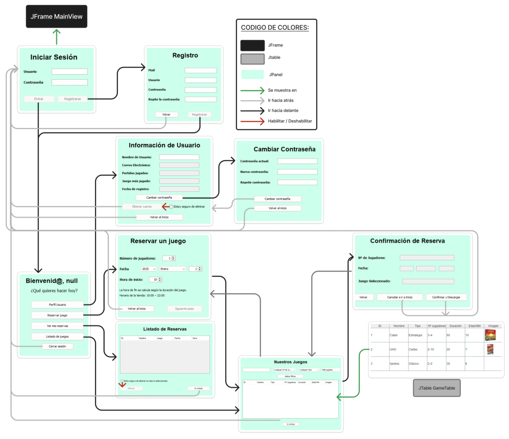
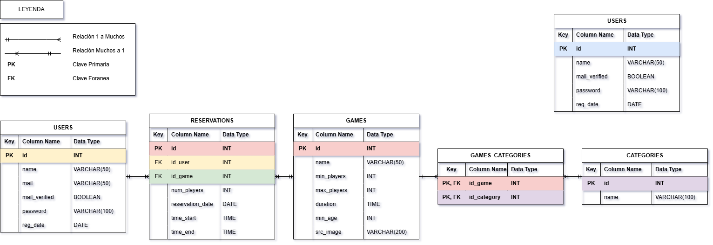
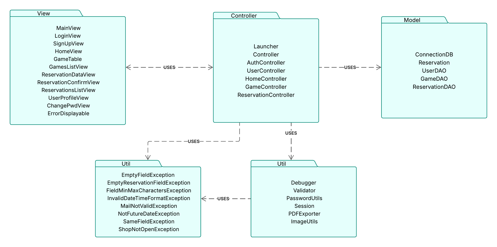

# 🧩 Board Games Manager

Board Game Manager es un programa de escritorio pensado para una supuesta empresa de probar juegos de mesa en el cual el usuario puede crearse un perfil y hacer diferentes reservas o consultar juegos.

# 🎯 Funcionalidades

- Iniciar sesion y registrarte
- Ver tu perfil y tus estadísticas
- Actualizar tu nombre / contraseña / eliminar la cuenta
- Consultar los juegos existentes (filtrando)
- Realizar y descargar la reserva de juegos en PDF
- Consultar / Eliminar reservas futuras

---

# 🎲 Cómo usar

### Repositorio GitHub

En   https://github.com/SergioGMunoz/BoardGames-manager puedes encontrar el repositorio con todo lo necesario

### Instrucciones:

- Clonar el repositorio desde GitHub

```bash
git clone https://github.com/SergioGMunoz/BoardGames-manager.git
```

- Ejecutar el script SQL para crear la base de datos

```bash
# Dentro de la carpeta del proyecto
 mysql -u root -p -e "source ./database.sql"
```

- Lanzar la app usando el archivo `run.bat`

```bash
# Dentro de la carpeta del proyecto
.\run.bat
```

---

# 🧠 Organización del Proyecto

### Notion

He utilizado notion principalmente para la organización del proyecto

- Asignación de tareas
- Documentación final

### Git

Git ha sido fundamental para el control de versiones del proyecto

- Controlar los cambios
- Trabajar con ramas para desarrollar funcionalidades por separado
- Poder volver atrás en caso de errores
- Documentar el progreso mediante mensajes de commit

---

# ⚙️ Tecnologías utilizadas

- **Java**: Lenguaje de programación
[🔗 java.com](https://www.java.com/)
- **Swing**: Biblioteca de Java para crear interfaces gráficas de usuario
[🔗 docs.oracle.com/javase/tutorial/uiswing](https://docs.oracle.com/javase/tutorial/uiswing)
- **Maven**: Compilación, pruebas, empaquetado y gestión de dependencias.  
[🔗 maven.apache.org](https://maven.apache.org/)
- **MySQL**: Base de Datos en local
[🔗 mysql.com](https://www.mysql.com/)
- **JDBC**: API de Java para conectar con mySQL
[🔗 docs.oracle.com/jdbc](https://docs.oracle.com/javase/8/docs/technotes/guides/jdbc)
- **iTextPDF**: Generar documento PDF
[🔗 itextpdf.com](https://itextpdf.com/)
- **JCalendar**: Insertar  componente calendario
[🔗 toedter.com/jcalendar](https://toedter.com/jcalendar)

---

# 📊 Diagrama de Ventanas

Aquí se puede ver el diagrama de ventanas de la aplicación, con los diferentes caminos que un usuario puede tomar.

Todos los diferentes JPanel se actualizan en la vista principal de forma que solo tenemos una ventana MainView donde se gestiona todo.



---

# 🧬 Estructura de datos

## Diagrama de Base de Datos

Aquí se puede ver el diagrama de como esta estructurada la información en la Base de datos de mySQL.



### Relaciones

- Un usuario puede hacer tantas reserva como quiera, la reserva solo esta a nombre de un usuario.
- Un juego puede aparecer en múltiples reservas pero solo hay un juego por reserva
- Un juego puede tener entre una y muchas categorías, cada categoría contiene uno o varios juegos
- La tabla dominios es independiente, sirve para verificar el campo mail de usuario

## Almacenamiento temporal en java

Internamente en el programa tenemos clases que almacenan información momentánea

### Clase **`Session`**

Es una clase con atributos y métodos estáticos encargada de guardar la información básica del usuario que ha iniciado sesión.

- `endSession()` 
Termina la sesión limpiando todos los datos
- `startSession(ArrayList<Object> data)`
Guarda los datos recibiendo los datos como parámetro

### Clase `Reservation`

Clase que guarda temporalmente los datos de la reserva que se está creando.

- `clearReservation()`
    
    Limpia todos los datos almacenados en la reserva.
    
- `getAllData()`
    
    Devuelve todos los datos actuales de la reserva como array de objetos.
    
- `setDateTime(LocalDateTime dateTime)`
    
    Establece la fecha y hora de inicio de la reserva a partir de un objeto `LocalDateTime`.
    

---

# 📦 Estructura del Código

Utilizamos la arquitectura **Modelo–Vista–Controlador** para estructurar el proyecto.

Gracias a esta arquitectura es mucho más fácil poder escalar el proyecto.

## Paquetes del proyecto

En este diagrama se pueden observar los diferentes paquetes del proyecto.



### **Vistas `view`**

Contiene todas las Interfaces gráficas de Swing, donde el usuario interactúa con el sistema.

Hace llamadas a los métodos de su controlador

- `MainView` JFrame donde se insertan las siguientes pantallas (sirve como marco)
- `ErrorDisplayable` Interfaz  para mostrar mensajes de error y borrarlos.
- `LoginView` Pantalla inicial de inicio de sesión.
- `SignUpView` Pantalla de registro nuevo usuario.
- `HomeView` Pantalla principal donde puedes escoger diferentes funciones.
- `GamesListView` Muestra los juegos con filtros se utiliza también para reservar un juego.
- `GameTable` Tabla con información detallada de los juegos.
- `ReservationDataView` Formulario de una nueva reserva.
- `ReservationConfirmView` Pantalla de confirmación y descarga PDF de reserva.
- `ReservationsListView` Lista de reservas realizadas por el usuario, puedes eliminarlas .
- `UserProfileView` Visualiza los datos del perfil del usuario.
- `ChangePwdView` Formulario para cambiar la contraseña del usuario.

---

### **Controladores `controller`**

Clases encargadas de gestionar los eventos de view e intervenir entre la vista y el modelo, controlando todo el flujo de la aplicación.

- `Launcher` Clase de inicio del programa.
- `Controller` Clase base para los controladores que actualiza la vista principal.
- `AuthController` Gestiona el inicio y registro de usuarios.
- `UserController` Gestiona todo lo relacionado con el usuario logueado (Perfil, Cambios, Eliminaciones)
- `HomeController` Gestiona la pantalla de home con los diferentes caminos posibles.
- `GameController` Gestiona todo lo relacionado con juegos mostrados.
- `ReservationController` Gestiona el proceso de reserva (Creación, modificación, descaga y eliminación)

---

### **Modelo `model`**

Se encarga de gestionar la estructura de datos, accede a la base de datos con sus clases DAO (Data Access Object)

- `ConnectionDB` Gestiona la conexión con la base de datos MySQL.
- `Reservation` Clase estática que almacena los datos temporales de una reserva.
- `UserDAO` Accede a la tabla de usuarios.
- `GameDAO` Accede  a la tabla de juegos y categorias
- `ReservationDAO` Accede a la tabla reservas.

### **Utilidades `utils`**

Contiene clases con funciones independientes reutilizables en todo el proyecto.

- `Debugger` Mostrar mensajes de depuración o errores
- `Validator` Validar diferentes campos de entrada de usuario
- `PasswordUtils`  Gestiona la encriptación de contraseñas.
- `Session` Guarda los datos del usuario activo durante una sesión.
- `PDFExporter` Genera documentos PDF para confirmar reservas.
- `ImageUtils` Carga y redimensiona imágenes.

### **Excepciones propias `utils.exceptions`**

Contiene excepciones personalizadas para representar errores específicos de validación con mensajes personalizados.

- `EmptyFieldException` Un campo está vacío.
- `EmptyReservationFieldException` Algún campo de la reserva no está relleno.
- `FieldMinMaxCharactersException`  Un campo no cumple con los mínimos o máximos caracteres.
- `InvalidDateTimeFormatException`  El formato de la fecha u hora no es válido.
- `MailNotValidException`  Formato del mail no  válido (*nombre@empresa.dominio*).
- `NotFutureDateException` Fecha introducida no es futura .
- `SameFieldException`  Si el campo a actualizar es el mismo que es anterior.
- `ShopNotOpenException` Si intenta reservar fuera del horario de apertura.

---
